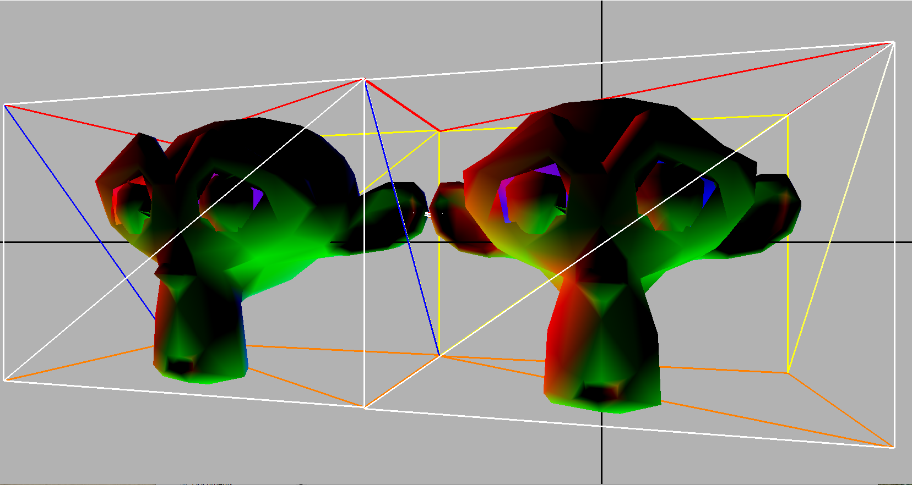
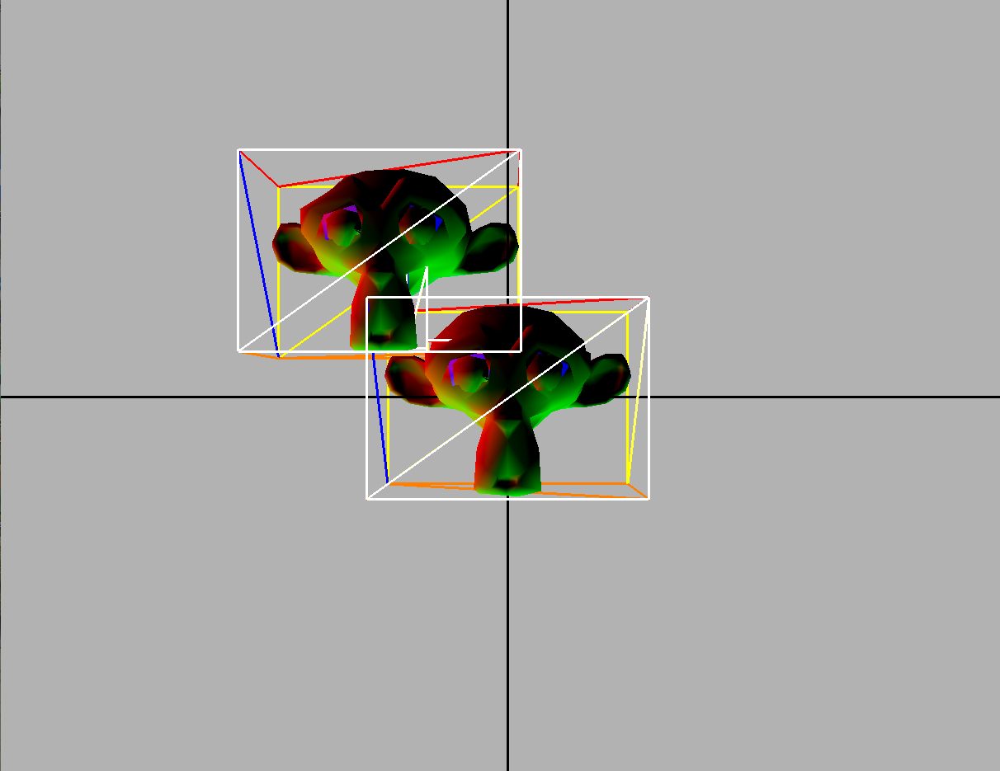

# Mesh_Collision
3D collision detection, axis-aligned bounding boxes (AABB) 

### description:
in the ClassExample2/main.cpp we added the function checkCollision() that will find if exists,
a collision between the shapes and will draw the smallest bounding boxes that collide.

in order to detect a collision we used a kd-tree, built from the vertices,and each node stores
in addition to the vertices also the center width height and depth of the bounding box for that node, that is calculated from the sub-tree.

in addition to the drawing of the smallest bounding boxes in a collision, 
every shape holds it's mesh and a cube mesh that is constructed from the root of the kdtree for that shape. Every frame we will draw both meshes

##  Images:

